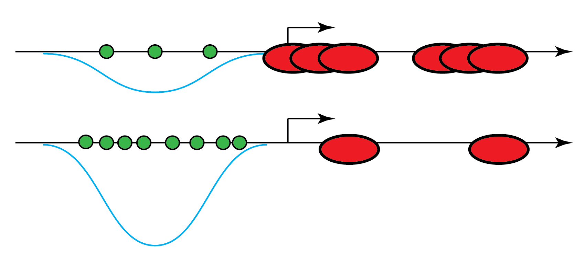

# yeast_bioinformatics

[This Jupyter notebook](http://nbviewer.jupyter.org/github/petermchale/yeast_bioinformatics/blob/master/analysis.ipynb) showcases a bioinformatic analysis of published yeast data written in Python 2.x. The analysis highlights the spectrum of propensities that transcription factors have for DNA, the statistics of nucleosome positioning on the genome, and how the two might interact with one another to co-regulate gene expression in yeast. 
