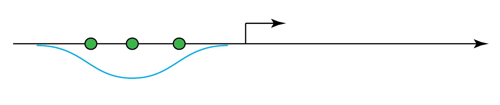

# yeast_bioinformatics

[This Jupyter notebook](http://nbviewer.jupyter.org/github/petermchale/yeast_bioinformatics/blob/master/analysis.ipynb) showcases a bioinformatic analysis in Python of published yeast data.  
